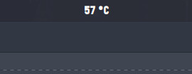

# Some Budgie Desktop Applet while messing around with Vala

## CPU Temp
Show cpu temp on budgie panel.
its support [pango-markup](https://developer.gnome.org/pango/stable/PangoMarkupFormat.html)


## Dependencies
```
budgie-1.0
gtk+-3.0
vala
```

### Install
```bash
meson build --prefix=/usr
cd build && ninja
sudo ninja install

```
### Usage
After installing, enable it on budgie desktop setting.
must include `%s` in the format
```html
 <span font="Gourmet Hearth 12"><b>%s &#xb0;C</b></span> 
```
